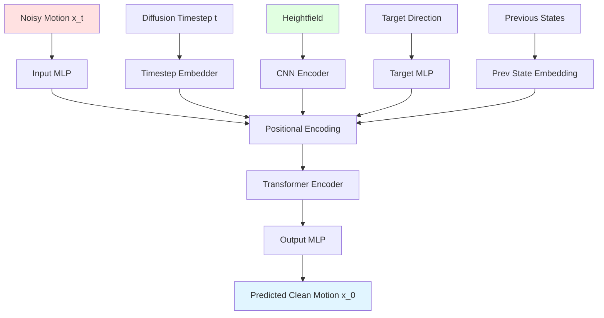

## Overview

The Motion Diffusion Model (MDM) is a transformer-based denoising diffusion probabilistic model that generates kinematic motion sequences conditioned on terrain geometry and target directions.

**Key Features:**
- Transformer encoder architecture with self-attention
- CNN-based heightfield conditioning
- Autoregressive generation support
- DDIM sampling for fast inference
- Predict-x0 formulation

**Source:** `PARC/motion_generator/mdm.py:116-1188`

## Architecture



## Motion Representation

### Feature Components

Motions are represented as sequences of frames, where each frame can include:

```python
frame_components = [
    "ROOT_POS",      # 3D position
    "ROOT_ROT",      # Rotation (representation varies)
    "JOINT_ROT",     # Per-joint rotations
    "CONTACTS"       # Binary contact labels
]
```

**Source:** `PARC/motion_generator/mdm.py:287-326`

### Rotation Representations

Supports multiple rotation types (configured via `rot_type`):

- **Quaternion** (4D) - Default, no gimbal lock
- **Exponential Map** (3D) - Compact, used in some losses
- **6D Rotation** (6D) - Continuous, good for learning
- **Rotation Matrix** (9D) - Redundant but explicit

Rotations are converted internally as needed.

**Source:** `PARC/motion_generator/mdm.py:178-179`

### Standardization

All features are standardized (z-score normalization):

```python
standardized = (features - mean) / std
```

Mean and std computed across entire dataset and cached to `sampler_stats.txt`.

**Source:** `PARC/motion_generator/mdm.py:442-513`

<Note>
Contact labels (0 or 1) are NOT standardized - their mean is set to 0 and std to 1.
</Note>

## Transformer Architecture

**Class:** `MDMTransformer`  
**Source:** `PARC/motion_generator/mdm_transformer.py:16-193`

### Token Structure

The transformer processes a sequence of tokens:

1. **Timestep token** (1) - Embedded diffusion timestep
2. **Observation tokens** (M) - CNN-encoded heightfield features  
3. **Target token** (1) - Target direction embedding
4. **Noise indicator token** (1) - Whether previous state is noisy
5. **Motion tokens** (N) - Motion sequence frames

Total sequence length: `1 + M + 1 + 1 + N`

**Source:** `PARC/motion_generator/mdm_transformer.py:44-96`

### Timestep Embedding

Sinusoidal positional encoding for diffusion timestep:

```python
class TimestepEmbedder(nn.Module):
    def __init__(self, d_model, max_timesteps):
        # Projects timestep to d_model dimensions
        # Uses learnable MLP after sinusoidal encoding
```

**Source:** `PARC/motion_generator/diffusion_util.py`

### Heightfield Conditioning

Local heightfield is encoded via CNN:

```yaml
cnn:
  net_name: "HeightfieldCNN"  
  # Typical config:
  # - Conv layers to extract spatial features
  # - Global pooling or flattening
  # - Output: M tokens of dimension d_token
```

CNN produces multiple tokens (e.g., M=4) that attend with motion tokens.

**Source:** `PARC/motion_generator/mdm_transformer.py:54-62`

### Attention Mask

Key padding mask controls which tokens attend to which:

```python
key_padding_mask = torch.zeros(batch_size, full_seq_len)
# Set to True to mask (ignore) specific tokens
key_padding_mask[:, obs_token_idx] = ~obs_flag  # Dropout
key_padding_mask[:, target_token_idx] = ~target_flag
```

Enables classifier-free guidance and conditional dropout.

**Source:** `PARC/motion_generator/mdm_transformer.py:99-135`

### Transformer Layers

```python
TransformerEncoderLayer(
    d_model=512,           # Token dimension
    num_heads=8,           # Attention heads  
    d_hid=2048,           # FFN hidden dimension
    dropout=0.1,
    activation="gelu",
    batch_first=True
)
```

Typically 8-12 layers deep.

**Source:** `PARC/motion_generator/mdm_transformer.py:85-88`

## Diffusion Process

### Forward Diffusion

Adds noise to clean motion over T timesteps:

```python
def forward_diffusion(x_0, t):
    noise = torch.randn_like(x_0)
    alpha_bar = sqrt_alphas_cumprod[t]
    sigma = sqrt_one_minus_alphas_cumprod[t]  
    x_t = alpha_bar * x_0 + sigma * noise
    return x_t
```

Uses variance schedule (linear, cosine, etc.).

**Source:** `PARC/motion_generator/mdm.py:777-788`

### Reverse Diffusion (DDPM)

Denoises motion step-by-step:

```python
for t in reversed(range(T)):
    # Predict clean motion from noisy x_t
    x_0_pred = model(x_t, conds, t)
    
    # Compute posterior q(x_{t-1} | x_t, x_0)  
    mean = coef1 * x_0_pred + coef2 * x_t
    x_t = mean + posterior_std * noise
```

Requires T forward passes.

**Source:** `PARC/motion_generator/mdm.py:855-894`

### DDIM Sampling

Faster sampling with stride > 1:

```python
timesteps = reversed(range(0, T, stride))
for t in timesteps:
    x_0_pred = model(x_t, conds, t)
    # Deterministic update (no noise added)
    x_t = ddim_step(x_0_pred, x_t, t, t - stride)
```

With `stride=10`, only 100 steps instead of 1000.

**Source:** `PARC/motion_generator/mdm.py:932-988`

<Tip>
Use DDIM with stride 10-20 for fast inference with minimal quality loss. DDPM (stride=1) gives best quality but is slowest.
</Tip>

## Conditioning

### Heightfield Observations

Local terrain around character:

```yaml
heightmap:
  local_grid:
    num_x_neg: 10  # Cells behind character
    num_x_pos: 30  # Cells in front  
    num_y_neg: 10  # Cells to left
    num_y_pos: 10  # Cells to right
  horizontal_scale: 0.1  # Cell size in meters
  max_h: 5.0  # Max height for normalization
```

Heightfield normalized to [-1, 1] range.

**Source:** `PARC/motion_generator/mdm.py:184-200`

### Target Direction

Desired movement direction:

```python
target_type = "XY_DIR"  # Unit vector in XY plane
# Alternatives:
# - "XY_POS": Target position (2D)
# - "XY_POS_AND_HEADING": Position + heading angle (3D)
```

Target computed from end of motion sequence during training.

**Source:** `PARC/motion_generator/mdm.py:208-217`

### Previous States

Temporal coherence via autoregression:

```python
num_prev_states = 2  # Condition on last 2 frames
```

Previous states can be:
- **Clean** (noise indicator = 1) - For autoregressive generation  
- **Noisy** (noise indicator = 0) - For training robustness

**Source:** `PARC/motion_generator/mdm.py:143-145`

### Dropout Strategies

Random dropout during training:

```yaml
obs_dropout: 0.1        # Ignore heightfield 10% of time
target_dropout: 0.1     # Ignore target 10% of time  
prev_state_attention_dropout: 0.1
prev_state_noise_ind_chance: 0.3  # Use noisy prev state
```

Improves robustness and enables classifier-free guidance.

**Source:** `PARC/motion_generator/mdm.py:135-145`

## Loss Functions

Multiple loss terms weighted and summed:

### Simple Losses

```python
# Root position L2 loss
root_pos_loss = ||pred_root_pos - true_root_pos||^2

# Rotation losses use quaternion angle difference  
root_rot_loss = angle_diff(pred_root_rot, true_root_rot)^2
joint_rot_loss = sum(angle_diff(pred_joint_rot, true_joint_rot)^2)

# Contact binary cross-entropy
contact_loss = ||pred_contacts - true_contacts||^2
```

**Source:** `PARC/motion_generator/mdm.py:622-637`

### Velocity Losses

```python
# Finite difference velocities
dt = 1.0 / fps
root_vel = (root_pos[t+1] - root_pos[t]) / dt
vel_loss = ||pred_root_vel - true_root_vel||^2

# Angular velocities from quaternion differences
root_ang_vel = quat_to_exp_map(quat_diff(rot[t], rot[t+1])) / dt  
ang_vel_loss = ||pred_ang_vel - true_ang_vel||^2
```

**Source:** `PARC/motion_generator/mdm.py:600-620`

### Forward Kinematics Losses

```python
# Compute body positions via FK
body_pos, body_rot = forward_kinematics(root_pos, root_rot, joint_rot)

# Match body positions in 3D space
fk_body_pos_loss = ||pred_body_pos - true_body_pos||^2
fk_body_rot_loss = sum(angle_diff(pred_body_rot, true_body_rot)^2)
```

Ensures physically plausible poses.

**Source:** `PARC/motion_generator/mdm.py:646-655`

### Heightfield Collision Loss

```python
# Sample points on character body
char_points = sample_body_points(body_pos, body_rot)

# Compute SDF (signed distance function) to heightfield  
sdf = compute_sdf(char_points, heightfield)

# Penalize penetration (sdf < 0)
collision_loss = sum(clamp(sdf, max=0)^2)
```

Prevents ground penetration.

**Source:** `PARC/motion_generator/mdm.py:669-677`

### Loss Weighting

```yaml
w_simple_root_pos: 1.0
w_simple_root_rot: 10.0  
w_simple_joint_rot: 10.0
w_simple_contacts: 0.1
w_vel_root_pos: 0.1
w_vel_root_rot: 1.0
w_vel_joint_rot: 0.01  
w_body_pos: 1.0
w_body_rot: 1.0
w_hf: 10.0  # Collision loss
```

Tuned based on importance and scale.

**Source:** `PARC/motion_generator/mdm.py:149-171`

## Training

### Training Loop

```python
for epoch in range(epochs):
    for iter in range(iters_per_epoch):
        # Sample batch from dataset
        motion_data, hfs, target_info = sampler.sample(batch_size)
        
        # Construct conditions
        conds = construct_conds(motion_data, hfs, target_info)
        x_0 = assemble_features(motion_data)
        
        # Random timestep
        t = random.randint(0, diffusion_timesteps)
        
        # Forward diffusion  
        x_t = forward_diffusion(x_0, t)
        
        # Predict clean motion
        x_0_pred = model(x_t, conds, t)
        
        # Compute losses
        loss = compute_losses(x_0, x_0_pred, conds)
        
        # Backprop and update
        optimizer.zero_grad()
        loss.backward()
        clip_grad_norm_(parameters, 1.0)
        optimizer.step()
        
        # Update EMA model
        ema.update(model)
```

**Source:** `PARC/motion_generator/mdm.py:1067-1096`

### Exponential Moving Average (EMA)

Maintains smoothed model weights:

```python
if step > ema_start:
    for p, p_ema in zip(model.parameters(), ema_model.parameters()):
        p_ema.data = decay * p_ema.data + (1 - decay) * p.data
```

Typically `decay=0.9999`.

**Source:** `PARC/motion_generator/mdm.py:250-285`

### Gradient Clipping

```python
torch.nn.utils.clip_grad_norm_(model.parameters(), max_norm=1.0)
```

Prevents exploding gradients.

**Source:** `PARC/motion_generator/mdm.py:1091`

## Inference

### Autoregressive Generation

Generate long sequences by chaining:

```python
# Initialize with starting pose
prev_states = initial_pose

for segment in path:
    # Sample heightfield at current position
    hf = sample_heightfield(position, heading)
    
    # Compute target from path
    target = compute_target(position, path)
    
    # Generate next segment
    conds = {
        "prev_state": prev_states,
        "obs": hf,
        "target": target
    }
    
    motion_segment = model.generate(conds, ddim_stride=10)
    
    # Update for next iteration  
    prev_states = motion_segment[-2:]
    position += compute_displacement(motion_segment)
```

**Source:** `PARC/motion_synthesis/procgen/mdm_path.py`

### Classifier-Free Guidance

Strengthen conditioning at inference:

```python
# Generate with and without conditioning
x_0_cond = model(x_t, conds, t)
x_0_uncond = model(x_t, empty_conds, t)

# Interpolate predictions
scale = 1.5  # Guidance scale
x_0 = x_0_uncond + scale * (x_0_cond - x_0_uncond)
```

Increases adherence to terrain/target at cost of diversity.

**Source:** `PARC/motion_generator/mdm.py:836-851`

## Configuration Example

```yaml
# Model architecture
d_model: 512
num_heads: 8  
d_hid: 2048
num_layers: 8
dropout: 0.1

# Sequence parameters  
sequence_duration: 2.0  # seconds
sequence_fps: 30
num_prev_states: 2

# Diffusion
diffusion_timesteps: 1000
predict_mode: "PREDICT_X0"
test_mode: "MODE_DDIM"  
test_ddim_stride: 10

# Training
batch_size: 512
epochs: 1000  
iters_per_epoch: 100
lr: 0.0001
weight_decay: 0.0

# Features
features:
  rot_type: "QUAT"  
  frame_components:
    - "ROOT_POS"
    - "ROOT_ROT"
    - "JOINT_ROT"  
    - "CONTACTS"

# Conditioning
use_heightmap_obs: true
use_target_obs: true
target_type: "XY_DIR"
obs_dropout: 0.1
target_dropout: 0.1

# Loss weights
w_simple_root_pos: 1.0
w_simple_root_rot: 10.0
w_simple_joint_rot: 10.0  
w_vel_root_pos: 0.1
w_body_pos: 1.0
w_hf: 10.0
```

## Implementation Tips

<Tip>
**Memory optimization:** Use gradient checkpointing for transformer layers if GPU memory is limited. Can train with 2x larger batch size at ~20% slower speed.
</Tip>

<Warning>
**Quaternion normalization:** Always normalize quaternions after prediction to ensure unit length. The model may predict non-normalized values.
</Warning>

<Info>
**EMA for inference:** Use the EMA model for generation, not the latest training model. EMA weights are more stable and produce better quality.
</Info>