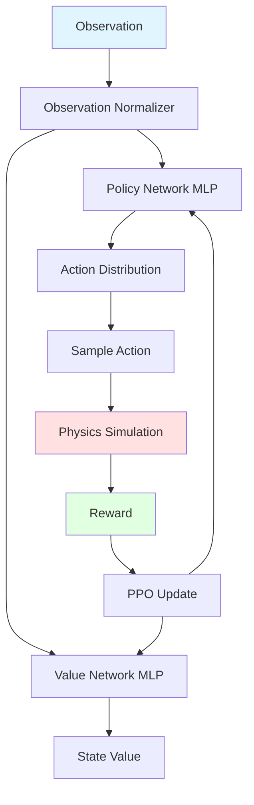

## Overview

The motion tracking controller is a reinforcement learning agent that learns to track kinematic reference motions in physics simulation. It uses Proximal Policy Optimization (PPO) with DeepMimic-style rewards in Isaac Gym.

**Key Components:**
- PPO algorithm with GAE
- DeepMimic tracking rewards
- Isaac Gym GPU-accelerated physics
- Parallel training across thousands of environments
- Adaptive motion weighting

**Source:** `PARC/motion_tracker/learning/dm_ppo_agent.py`

## Architecture



## Environment: DeepMimic

### Simulation Setup

**Platform:** NVIDIA Isaac Gym  
**Physics:** Position-Based Dynamics (PBD)  
**Timestep:** 60Hz (0.0167s)  
**Parallel envs:** Typically 4000-16000

**Source:** `PARC/motion_tracker/envs/ig_parkour/dm_env.py:19-93`

### Character Control

The simulated character uses PD (Proportional-Derivative) controllers:

```python
# Agent outputs target joint positions
target_dof_pos = policy(observation)

# PD controller computes torques  
kp = 1000.0  # Proportional gain
kd = 100.0   # Derivative gain

error_pos = target_dof_pos - current_dof_pos
error_vel = -current_dof_vel  # Target velocity is 0

torque = kp * error_pos + kd * error_vel
torque = clamp(torque, -torque_limit, torque_limit)
```

Torques applied to joints each simulation step.

### Terrain Layout

Environments arranged in 2D grid to avoid numerical issues:

```python
num_envs = num_motions * terrains_per_motion

# Grid dimensions
num_envs_x = ceil(sqrt(num_envs))
num_envs_y = ceil(sqrt(num_envs))

# Each environment has offset
env_offset_x = env_id % num_envs_x * terrain_width
env_offset_y = env_id // num_envs_x * terrain_height
```

Terrains loaded from motion files and converted to Isaac Gym trimeshes.

**Source:** `PARC/motion_tracker/envs/ig_parkour/dm_env.py:182-199`

### Characters

Two characters per environment:
- **Simulated character** (index 0) - Controlled by agent, physics-based
- **Reference character** (index 1) - Kinematic, plays back reference motion

Reference character is transparent/ghosted for visualization.

**Source:** `PARC/motion_tracker/envs/ig_parkour/dm_env.py:16-17`

## Observation Space

The agent observes:

```python
obs_components = [
    # Character state
    "root_pos",           # 3D (relative to ref)
    "root_rot",           # 4D quaternion  
    "root_vel",           # 3D linear velocity
    "root_ang_vel",       # 3D angular velocity
    "dof_pos",            # N_dof joint positions
    "dof_vel",            # N_dof joint velocities
    
    # Reference motion (target)
    "ref_root_pos",       # 3D
    "ref_root_rot",       # 4D quaternion
    "ref_dof_pos",        # N_dof
    "ref_body_pos",       # N_body x 3D (from FK)
    "ref_body_rot",       # N_body x 4D quaternions
    
    # Terrain
    "heightmap",          # H x W grid
    
    # Contacts  
    "ref_contacts",       # N_body binary labels
]
```

Observations are relative (sim - ref) to make learning easier.

### Observation Normalization

Running mean/std normalization:

```python
class Normalizer:
    def normalize(self, obs):
        self.mean = 0.99 * self.mean + 0.01 * obs.mean()
        self.std = 0.99 * self.std + 0.01 * obs.std()
        return (obs - self.mean) / (self.std + 1e-5)
```

Some observations excluded from normalization:
- Heightmaps (already in [-1, 1])
- Contact labels (binary)

**Source:** `PARC/motion_tracker/learning/dm_ppo_agent.py:49-86`

<Note>
Observations are clipped to [-5, 5] after normalization to prevent extreme values from destabilizing training.
</Note>

## Reward Function

### DeepMimic Rewards

Reward is product of individual terms (all in [0, 1]):

```python
reward = (
    w_root_pos * exp(-k_pos * ||sim_root - ref_root||^2) *
    w_root_rot * exp(-k_rot * angle_diff(sim_rot, ref_rot)^2) *  
    w_body_pos * exp(-k_body * mean(||sim_body - ref_body||^2)) *
    w_body_rot * exp(-k_body_rot * mean(angle_diff(sim_body_rot, ref_body_rot)^2)) *
    w_dof_vel * exp(-k_vel * ||sim_vel - ref_vel||^2) *
    w_end_eff * exp(-k_eff * mean(||sim_eff - ref_eff||^2))
)
```

### Reward Weights

```yaml
reward_weights:
  w_root_pos: 0.3
  w_root_rot: 0.2  
  w_body_pos: 0.3
  w_body_rot: 0.1
  w_dof_vel: 0.05
  w_end_eff: 0.05
```

### Reward Scales

```yaml
reward_scales:  
  k_pos: 10.0     # Position error -> reward
  k_rot: 5.0      # Rotation error -> reward
  k_body: 20.0    # Body pos error -> reward
  k_vel: 0.1      # Velocity error -> reward
```

Higher scale = more sensitive to errors.

### Early Termination

Episode ends early if:

```python
# Tracking error too high
root_pos_error > 1.0  # 1 meter
root_rot_error > pi/2  # 90 degrees  
body_pos_error > 0.5  # Per body

# Character falls
root_height < 0.3  # Below threshold

# Motion complete
motion_time >= motion_length
```

Early termination prevents learning invalid behaviors.

## PPO Algorithm

**Class:** `DMPPOAgent`  
**Source:** `PARC/motion_tracker/learning/dm_ppo_agent.py:17-363`

### Hyperparameters

```yaml
# Rollout
rollout_length: 8         # Steps per rollout
num_envs: 4096            # Parallel environments

# Optimization
mini_batch_size: 4096     # Samples per mini-batch  
num_epochs: 5             # Epochs per update
learning_rate: 0.0001
clip_epsilon: 0.2         # PPO clipping

# GAE (Generalized Advantage Estimation)
discount: 0.99            # Gamma
td_lambda: 0.95           # Lambda for GAE

# Normalization
norm_adv_clip: 5.0        # Advantage clipping
norm_obs_clip: 5.0        # Observation clipping
```

### Policy and Value Networks

```python
class DMPPOModel:
    def __init__(self):
        # Policy network
        self.policy = MLP([
            obs_dim,
            1024,
            512,  
            512,
            action_dim * 2  # Mean and log_std
        ])
        
        # Value network (can be shared or separate)
        self.value = MLP([
            obs_dim,
            1024,
            512,
            512,  
            1  # State value
        ])
```

Action distribution is diagonal Gaussian:

```python
mean, log_std = policy(obs).chunk(2, dim=-1)
std = exp(log_std)
action_dist = Normal(mean, std)
action = action_dist.sample()
```

### Training Loop

```python
for iteration in range(max_iterations):
    # Rollout phase
    for step in range(rollout_length):
        action = policy.sample(obs)
        next_obs, reward, done, info = env.step(action)  
        buffer.store(obs, action, reward, done, value)
        obs = next_obs
    
    # Compute advantages with GAE
    advantages = compute_gae(rewards, values, dones, gamma, lambda)
    
    # Normalize advantages
    advantages = (advantages - advantages.mean()) / advantages.std()
    
    # Update phase
    for epoch in range(num_epochs):
        for batch in buffer.mini_batches(mini_batch_size):
            # Compute policy loss (clipped)
            ratio = new_prob / old_prob
            clipped_ratio = clamp(ratio, 1-eps, 1+eps)
            policy_loss = -min(ratio * adv, clipped_ratio * adv)
            
            # Compute value loss
            value_loss = (value - target_value)^2
            
            # Entropy bonus for exploration  
            entropy_loss = -entropy(action_dist)
            
            # Total loss
            loss = policy_loss + 0.5 * value_loss + 0.01 * entropy_loss
            
            # Update
            optimizer.zero_grad()
            loss.backward()
            optimizer.step()
```

**Source:** `PARC/motion_tracker/learning/ppo_agent.py`

### GAE (Generalized Advantage Estimation)

```python
def compute_gae(rewards, values, dones, gamma, lambda):
    advantages = []
    gae = 0
    
    for t in reversed(range(len(rewards))):
        if dones[t]:
            next_value = 0
        else:
            next_value = values[t+1]
        
        # TD error
        delta = rewards[t] + gamma * next_value - values[t]
        
        # GAE recursion
        gae = delta + gamma * lambda * gae  
        advantages.insert(0, gae)
    
    return advantages
```

**Source:** `PARC/motion_tracker/learning/rl_util.py`

## Experience Buffer

Stores rollout data:

```python
class ExperienceBuffer:
    buffers = {
        "obs": (rollout_length, num_envs, obs_dim),
        "action": (rollout_length, num_envs, action_dim),
        "reward": (rollout_length, num_envs),  
        "done": (rollout_length, num_envs),
        "value": (rollout_length, num_envs),
        "log_prob": (rollout_length, num_envs),
        
        # Computed after rollout
        "advantage": (rollout_length, num_envs),
        "target_value": (rollout_length, num_envs),
    }
```

**Source:** `PARC/motion_tracker/learning/dm_ppo_agent.py:239-264`

## Adaptive Motion Weighting

### Failure Rate Tracking

Each motion has a tracked failure rate:

```python
motion_id_fail_rates = torch.ones(num_motions)  # Initialize to 1.0

# After each episode
if done:
    if success:
        fail_rate_update = 0.0  
    else:
        fail_rate_update = 1.0
    
    # Exponential moving average
    ema_weight = 0.01
    motion_id_fail_rates[motion_id] = (
        (1 - ema_weight) * motion_id_fail_rates[motion_id] +
        ema_weight * fail_rate_update
    )
```

**Source:** `PARC/motion_tracker/envs/ig_parkour/dm_env.py:86-90`

### Sampling Weights

Motions with higher fail rates sampled more often:

```python
fail_rate_quantiles = [0.1, 0.3, 0.5, 0.7]  # Thresholds

# Assign weights based on quantile  
for motion_id in range(num_motions):
    fail_rate = motion_id_fail_rates[motion_id]
    
    if fail_rate < quantiles[0]:
        weight = 0.1  # Easy motion - low weight
    elif fail_rate < quantiles[1]:
        weight = 0.3
    elif fail_rate < quantiles[2]:  
        weight = 0.5
    elif fail_rate < quantiles[3]:
        weight = 0.7
    else:
        weight = 1.0  # Hard motion - high weight
    
    sampling_weights[motion_id] = weight
```

Focuses training on difficult motions.

**Source:** `PARC/motion_tracker/envs/ig_parkour/dm_env.py:32-33`

### Weight Persistence

Fail rates saved to checkpoint:

```python
# Save
torch.save(motion_id_fail_rates.cpu(), "fail_rates_iter.pt")

# Load for next iteration  
motion_id_fail_rates = torch.load("fail_rates_iter.pt").to(device)
```

**Source:** `PARC/motion_tracker/learning/dm_ppo_agent.py:360-362`

## Training Details

### Curriculum Learning

Start with easier motions, gradually add harder:

1. **Iteration 0:** Small dataset of clean reference motions
2. **Iteration 1:** Add some generated motions (easier terrain)
3. **Iteration 2+:** Progressively harder terrain and longer motions

### Testing During Training

Periodic evaluation:

```python
if iter % iters_per_test == 0:
    policy.eval()
    test_info = test_model(num_test_episodes=100)
    
    metrics = {
        "mean_return": test_info["mean_return"],
        "mean_ep_len": test_info["mean_ep_len"],
        "root_pos_err": test_info["root_pos_err"],
        "root_rot_err": test_info["root_rot_err"],
        "body_pos_err": test_info["body_pos_err"],
    }
    
    logger.log(metrics)
    policy.train()
```

**Source:** `PARC/motion_tracker/learning/dm_ppo_agent.py:94-180`

### Checkpointing

```python
if iter % iters_per_checkpoint == 0:
    checkpoint = {
        "model_state_dict": model.state_dict(),
        "optimizer_state_dict": optimizer.state_dict(),  
        "obs_normalizer": obs_norm.state_dict(),
        "iter": iter,
    }
    torch.save(checkpoint, f"model_{iter}.pt")
```

**Source:** `PARC/motion_tracker/learning/ppo_agent.py`

## Tracking Error Metrics

Detailed error tracking:

```python
class TrackingErrorTracker:
    def update(self, error_dict, done):
        self.root_pos_err += error_dict["root_pos_err"]
        self.root_rot_err += error_dict["root_rot_err"]  
        self.body_pos_err += error_dict["body_pos_err"]
        self.body_rot_err += error_dict["body_rot_err"]
        self.dof_vel_err += error_dict["dof_vel_err"]
        self.root_vel_err += error_dict["root_vel_err"]
        
        # Count episodes
        self.num_episodes += done.sum()
```

**Source:** `PARC/motion_tracker/learning/tracking_error_tracker.py`

## Performance Optimization

### GPU Acceleration

Isaac Gym runs physics on GPU:
- All tensors on GPU
- No CPU-GPU transfers during rollout
- Parallel simulation of thousands of envs

### Batch Processing

All operations batched:

```python
# Single forward pass for all envs
actions = policy(obs)  # Shape: (num_envs, action_dim)

# Single simulation step for all envs
next_obs, rewards, dones, infos = env.step(actions)
```

### Memory Layout

Contiguous tensors for efficiency:

```python
# Flatten multi-dimensional observations  
obs = torch.cat([
    root_pos.view(num_envs, -1),
    root_rot.view(num_envs, -1),
    dof_pos.view(num_envs, -1),
    heightmap.view(num_envs, -1),
], dim=-1)
```

## Configuration Example

```yaml
# Environment
env:
  num_envs: 4096
  sim_device: "cuda:0"
  headless: true
  
  dm:
    motion_file: "data/motions.yaml"
    terrains_per_motion: 1
    random_reset_pos: false
    terrain_build_mode: "file"  # Or "square", "wide"
    
    fail_rate_quantiles: [0.1, 0.3, 0.5, 0.7]
    min_motion_weight: 0.01
    
    heightmap:
      horizontal_scale: 0.1
      padding: 1.0
    
    reward_weights:
      w_root_pos: 0.3
      w_root_rot: 0.2
      w_body_pos: 0.3
      w_body_rot: 0.1
      w_dof_vel: 0.05
      w_end_eff: 0.05

# Agent  
agent:
  algorithm: "DM_PPO"
  
  rollout:
    rollout_length: 8
    
  training:
    num_epochs: 5
    mini_batch_size: 4096
    learning_rate: 0.0001
    
  ppo:
    clip_epsilon: 0.2
    
  gae:
    discount: 0.99  
    td_lambda: 0.95
    
  normalization:
    norm_adv_clip: 5.0
    norm_obs_clip: 5.0

# Model
model:
  policy_layers: [1024, 512, 512]  
  value_layers: [1024, 512, 512]
  activation: "relu"
  
# Training loop
max_samples: 100000000  # 100M samples
iters_per_output: 100
iters_per_checkpoint: 500
test_episodes: 100
```

## Tips

<Tip>
**Warm start:** Initialize the tracker from a previous iteration's checkpoint to speed up training on new motions.
</Tip>

<Warning>
**Reward scaling:** Ensure rewards are properly scaled (typically [0, 1] range). Improperly scaled rewards can destabilize PPO.
</Warning>

<Info>
**Parallelization:** More parallel environments = better sample efficiency. Aim for at least 2048-4096 environments for stable training.
</Info>

<Note>
**Testing frequency:** Test every 100-200 iterations to monitor progress without slowing down training significantly.
</Note>