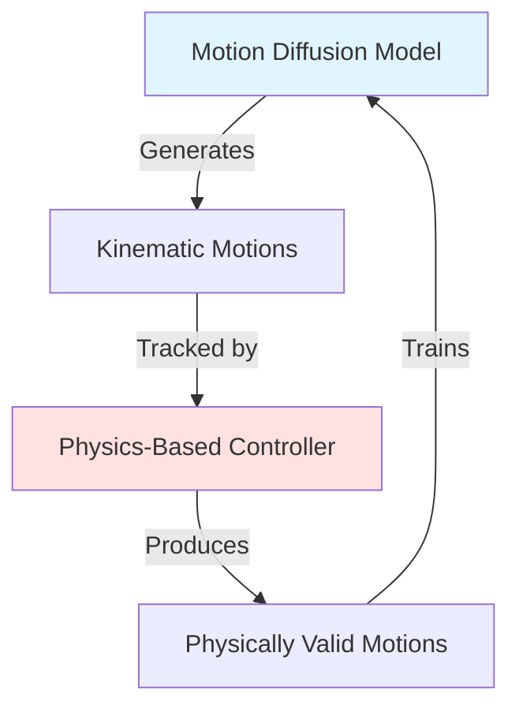

## What is PARC?

PARC is a **self-consuming self-correcting generative model framework** that trains both a kinematic motion generation model and a physics-based tracking controller while generating spatial, temporal, and functional variations of motions in the initial dataset.

The framework was introduced in SIGGRAPH 2025 for terrain-traversal motions, but the architecture is designed to be applicable to different motion synthesis tasks.

## Core Architecture

PARC combines three key components that work in an iterative loop:

### 1. Motion Diffusion Model (MDM)

A transformer-based diffusion model that generates kinematic motion sequences conditioned on:
- **Local heightmap observations** - terrain geometry around the character
- **Target direction** - desired movement direction
- **Previous motion states** - for temporal coherence

**Key Features:**
- Transformer encoder architecture with self-attention
- Denoising diffusion probabilistic model (DDPM)
- DDIM sampling for faster inference
- Heightfield conditioning via CNN encoder

<Info>
The MDM uses a predict-x0 formulation, predicting the clean motion directly rather than predicting noise.
</Info>

### 2. Motion Tracking Controller

A PPO-based reinforcement learning agent that learns to track reference motions in physics simulation:
- **Environment:** Isaac Gym GPU-accelerated physics
- **Algorithm:** Proximal Policy Optimization (PPO)
- **Architecture:** DeepMimic-based tracking rewards
- **Observation space:** Character state + reference motion + terrain heightmap

**Training Features:**
- Parallel training across thousands of environments
- Adaptive motion weighting based on tracking difficulty
- Early termination on tracking failure

### 3. Procedural Motion Generation

Connects the MDM and controller by generating diverse motion variations:
- **Terrain generation** - random boxes, stairs, paths
- **Path planning** - A* pathfinding on terrain graphs
- **Autoregressive generation** - MDM generates motions along paths
- **Kinematic optimization** - refines motions for trackability
- **Heuristic filtering** - selects high-quality candidates

## Data Flow

Motions in PARC are represented with:
- **Root position** (3D) and **root rotation** (quaternion)
- **Joint rotations** (quaternions per joint)
- **Contact labels** (binary per body part)
- **Terrain heightfields** (2D grids)

<Note>
All motion data uses quaternions internally for rotations, which are converted to other representations (exp map, 6D rotation) for specific model inputs.
</Note>

## Training Paradigm

PARC follows a **self-improving loop**:

1. **Bootstrap** - Start with a small dataset of reference motions
2. **Generate** - MDM creates diverse kinematic variations
3. **Track** - Controller learns to track generated motions
4. **Record** - Successfully tracked motions are physically validated
5. **Augment** - Physical motions added back to training dataset
6. **Repeat** - Next iteration with expanded dataset

Each iteration:
- Expands motion diversity (spatial/temporal variations)
- Improves motion quality (physics-validated)
- Increases dataset size (more training data)

## Key Implementation Details

**Motion Library** (`PARC/anim/motion_lib.py`)
- Frame-based motion representation
- Efficient batched sampling
- Support for looping and non-looping motions
- Forward kinematics computation

**Character Model** (`PARC/anim/kin_char_model.py`)
- XML-based character definition
- Forward kinematics (FK) for pose computation
- DOF to quaternion conversion
- Body part hierarchy

**Training Infrastructure**
- Weights & Biases integration for logging
- Checkpoint saving at configurable intervals
- EMA (Exponential Moving Average) for model weights
- Adaptive learning rate schedules

## Configuration System

PARC uses YAML configuration files for all components:
- Motion diffusion model config
- Tracking controller config  
- Procedural generation config
- Dataset creation config

The `parc_0_setup_iter.py` script automatically generates all required configs for a PARC iteration.

<Tip>
Use `scripts/parc_0_setup_iter.py` to set up configuration files for all stages. It handles path resolution, dataset merging, and sampling weight computation.
</Tip>

## Next Steps

<CardGroup cols={2}>
  <Card title="PARC Loop" icon="rotate" href="/concepts/parc-loop">
    Learn about the 4-stage iterative training process
  </Card>
  <Card title="Motion Diffusion" icon="wave-square" href="/concepts/motion-diffusion">
    Deep dive into the MDM architecture
  </Card>
  <Card title="Motion Tracking" icon="running" href="/concepts/motion-tracking">
    Understand the physics-based controller
  </Card>
  <Card title="Data Format" icon="file-code" href="/concepts/data-format">
    Learn the motion file format specification
  </Card>
</CardGroup>