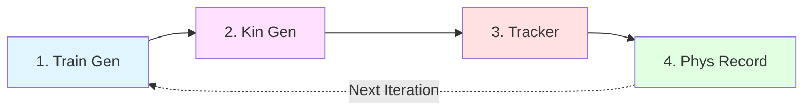
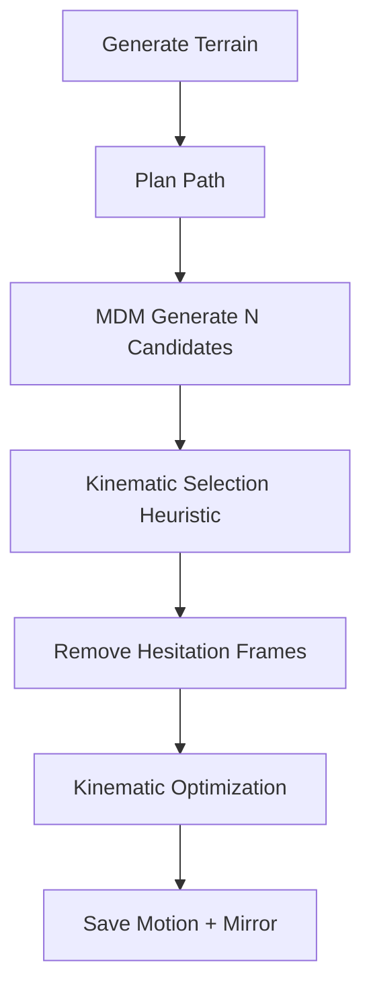

## Overview

The PARC training loop consists of 4 main stages that execute sequentially. Each stage is independent and configured via YAML files, allowing flexible experimentation.



## Stage 0: Setup Iteration

**Script:** `scripts/parc_0_setup_iter.py`

Before running the PARC loop, this setup script configures all stages:

### Key Functions

1. **Generate configuration files** for all 4 stages
2. **Compute sampling weights** for motion classes (e.g., balance climbing vs. running motions)
3. **Pre-compute terrain data** for augmentation during MDM training
4. **Set up directory structure** for outputs

### Configuration Structure

```yaml
output_dir: "path/to/iteration_output"
input_mdm_config_path: "configs/mdm.yaml"
input_kin_gen_config_path: "configs/kin_gen.yaml"
input_tracker_config_path: "configs/tracker.yaml"
input_phys_record_config_path: "configs/phys_record.yaml"
iter_start_dataset_path: "data/motions.yaml"
```

**Source:** `scripts/parc_0_setup_iter.py:21-185`

<Note>
The setup script automatically creates timestamped configs and simple symlinked configs for each stage in subdirectories `p1_train_gen`, `p2_kin_gen`, `p3_tracker`, and `p4_phys_record`.
</Note>

---

## Stage 1: Train Generator

**Script:** `scripts/parc_1_train_gen.py`

Trains or fine-tunes the motion diffusion model (MDM) on the current dataset.

### Process Flow

1. **Load or create motion sampler** from dataset
   - Motion sampler handles weighted sampling with replacement
   - Pre-computes heightfield data for each motion
   - Caches sampler to disk for faster subsequent loads

2. **Compute dataset statistics**
   - Mean and std for motion features across all sequences
   - Used for feature normalization during training
   - Cached to `sampler_stats.txt`

3. **Initialize or load MDM model**
   - Can start from scratch or fine-tune existing checkpoint
   - Supports EMA (Exponential Moving Average) for stable training

4. **Training loop**
   - Random timestep sampling (0 to `diffusion_timesteps`)
   - Forward diffusion: add noise to clean motions
   - Denoising: predict clean motion from noisy input
   - Multiple loss terms (see Motion Diffusion page)

### Training Configuration

```yaml
epochs: 1000
batch_size: 512
iters_per_epoch: 100
diffusion_timesteps: 1000
learning_rate: 0.0001
weight_decay: 0.0
```

**Source:** `scripts/parc_1_train_gen.py:30-113`

### Outputs

- `checkpoints/model_*.ckpt` - Periodic checkpoints
- `final_model.ckpt` - Final trained model
- `sampler.pkl` - Cached motion sampler
- `sampler_stats.txt` - Dataset statistics

<Tip>
Set `use_wandb: true` in the config to enable Weights & Biases logging. Training metrics include per-component losses, wall time, and number of samples processed.
</Tip>

---

## Stage 2: Kinematic Generation

**Script:** `scripts/parc_2_kin_gen.py`

Generates new kinematic motion sequences using the trained MDM.

### Generation Pipeline



### Detailed Steps

#### 1. Terrain Generation

Random procedural terrains:
- **Random boxes** - scattered box obstacles
- **Random stairs** - ascending/descending staircases  
- **Random paths** - narrow walkways

Terrains are represented as heightfields (2D elevation grids).

**Source:** `PARC/util/terrain_util.py`

#### 2. Path Planning

A* pathfinding algorithm treats terrain as a graph:
- Nodes: grid cells in heightfield
- Edges: traversable connections (consider height changes)
- Cost: distance + height penalty

**Source:** `PARC/motion_synthesis/procgen/astar.py`

#### 3. Autoregressive Generation

MDM generates motions step-by-step along the path:
- Start with initial pose
- Generate sequence segment conditioned on heightmap + target direction
- Use end of previous segment as start of next
- Repeat until path is complete

**Source:** `PARC/motion_synthesis/procgen/mdm_path.py`

#### 4. Candidate Selection

Generate `N` candidate sequences (e.g., N=10) and select top `K` (e.g., K=3) using heuristics:
- Foot contact consistency
- Smooth velocity profiles  
- Minimal ground penetration
- Path following accuracy

#### 5. Hesitation Removal

Detect and remove frames where character hesitates:
- Low velocity + low acceleration = hesitation
- Remove consecutive hesitation frames
- Re-blend motion segments

#### 6. Kinematic Optimization

Refine motion to improve trackability:
- Foot contact constraints (IK)
- Body position targets
- Smooth velocity constraints
- Collision avoidance

**Source:** `PARC/motion_synthesis/motion_opt/motion_optimization.py`

### Batch Generation

Stage 2 typically generates motions in batches:

```yaml
kin_gen_num_batches_of_motions: 10
kin_gen_num_motions_per_batch: 50
kin_gen_motion_id_offset: 0
```

This generates 10 batches × 50 motions = 500 new motions.

**Source:** `scripts/parc_0_setup_iter.py:42-145`

### Outputs

For each batch:
- `ignore/raw/` - Unoptimized generated motions
- `<batch_name>/` - Optimized motions ready for tracking
- Motion files in `.ms` format with terrain data

<Warning>
The generated motions are kinematic only - they may not be physically valid. Stage 3 (tracking) validates them in physics simulation.
</Warning>

---

## Stage 3: Train Tracker

**Script:** `scripts/parc_3_tracker.py`

Trains a PPO agent to track the generated reference motions in Isaac Gym.

### Environment Setup

DeepMimic-style tracking environment:
- **Simulated character** - follows PD controller to track reference
- **Reference character** - plays back kinematic motion
- **Terrain** - heightfield collision geometry
- **Parallel envs** - thousands of environments in parallel (one per motion)

**Source:** `PARC/motion_tracker/envs/ig_parkour/dm_env.py:19-93`

### Observation Space

The agent observes:
- Character state (joint positions, velocities, root state)
- Reference motion (target poses from kinematic motion)
- Heightmap (local terrain geometry)
- Contact labels (target foot contacts)

### Reward Function

DeepMimic-style tracking rewards:
- **Root position error** - distance between sim and ref root
- **Root rotation error** - angular difference
- **Body position error** - per-body position differences  
- **Body rotation error** - per-body angular differences
- **Joint velocity error** - velocity matching
- **End effector error** - foot/hand position matching

<Info>
Early termination occurs when tracking error exceeds threshold, preventing the agent from learning invalid motions.
</Info>

### Training Details

- **Algorithm:** PPO with GAE (Generalized Advantage Estimation)
- **Policy network:** MLP with 2-4 hidden layers (512-1024 units)
- **Value network:** Shared or separate MLP
- **Updates:** Multiple epochs per rollout buffer
- **Clipping:** PPO ratio clipping (ε = 0.2)

**Source:** `PARC/motion_tracker/learning/dm_ppo_agent.py:17-363`

### Adaptive Motion Weighting

Motions are weighted by tracking difficulty:
- Easier motions (low fail rate) get lower weight
- Harder motions (high fail rate) get higher weight
- Fail rates updated via exponential moving average

```python
self._ema_weight = 0.01
fail_rate = success_rate.new()
new_fail_rate = (1 - ema_weight) * old_fail_rate + ema_weight * fail_rate
```

**Source:** `PARC/motion_tracker/envs/ig_parkour/dm_env.py:86-90`

### Grid Layout

Environments arranged in 2D grid (not a line) to avoid numerical issues with large coordinates:

```
[Env 0] [Env 1] [Env 2] ...
[Env N] [Env N+1] ...
...
```

Each environment has its own terrain and reference motion.

### Outputs

- `model.pt` - Trained PPO policy
- `agent_config.yaml` - Agent configuration
- `dm_env.yaml` - Environment configuration  
- `fail_rates_*.pt` - Per-motion failure rates

---

## Stage 4: Physics Recording

**Script:** `scripts/parc_4_phys_record.py`

Records physically simulated motions by running the trained controller.

### Recording Process

1. **Load trained controller** from Stage 3
2. **Load generated motions** from Stage 2
3. **Simulate in parallel** - run controller on all motions simultaneously
4. **Record successful tracks** - save motions that complete without early termination
5. **Retry with offsets** - for partial failures, try starting from later frames

### Retry Strategy

If tracking fails:
1. Try starting from beginning (0% into motion)
2. If fails, try starting from 25% into motion
3. If fails, try starting from 50% into motion  
4. If all fail, discard motion

This recovers motions where only a small segment is untrackable.

**Source:** `doc/parc_guide.md:63-68`

### Quality Control

Only save motions that:
- Complete without early termination
- Maintain low tracking error throughout
- Stay within terrain bounds
- Don't violate physics constraints

### Outputs

- Physically valid motion files (`.ms` format)
- Only successfully tracked motions included
- These motions are added to the dataset for next iteration

<Note>
The recorded motions are subtly different from the kinematic references due to physics simulation, but they are guaranteed to be physically plausible.
</Note>

---

## Iteration Management

A complete PARC iteration:

```bash
# Setup iteration
python scripts/parc_0_setup_iter.py --config configs/setup.yaml

# Stage 1: Train generator
python scripts/parc_1_train_gen.py --config output/p1_train_gen/mdm_config.yaml

# Stage 2: Generate motions (run in parallel)
for config in output/p2_kin_gen/*/kin_gen_config.yaml; do
    python scripts/parc_2_kin_gen.py --config $config
done

# Stage 3: Train tracker  
python scripts/parc_3_tracker.py --config output/p3_tracker/tracker.yaml

# Stage 4: Record physics
python scripts/parc_4_phys_record.py --config output/p4_phys_record/phys_record.yaml
```

### Next Iteration

For iteration N+1:
1. Update `iter_start_dataset_path` to include physically recorded motions from iteration N
2. Optionally use final MDM checkpoint as `input_mdm_model_path`  
3. Optionally use final tracker checkpoint as `input_tracker_model_path`
4. Run `parc_0_setup_iter.py` with updated config
5. Execute 4 stages again

## Performance Considerations

**Stage 1 (Train Gen)**
- GPU memory: ~8-16GB for batch size 512
- Training time: Hours to days depending on epochs
- Checkpoint frequently for long runs

**Stage 2 (Kin Gen)** 
- CPU intensive for optimization
- Highly parallelizable (run batches independently)
- Can take hours per batch with optimization

**Stage 3 (Tracker)**
- Requires GPU with Isaac Gym support
- Most computationally expensive stage
- Training time: Days for complex motions
- Scales with number of motions × terrains per motion

**Stage 4 (Phys Record)**
- Fast (minutes to hours)
- Parallel execution across all environments
- GPU memory scales with number of motions

<Tip>
Run Stage 2 batches in parallel on multiple machines to speed up kinematic generation. Each batch is independent.
</Tip>